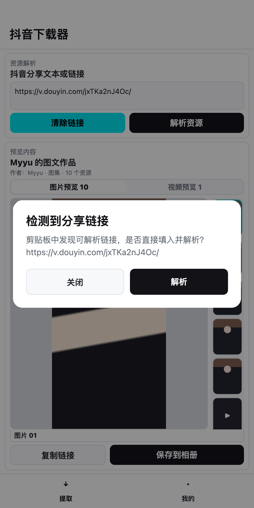
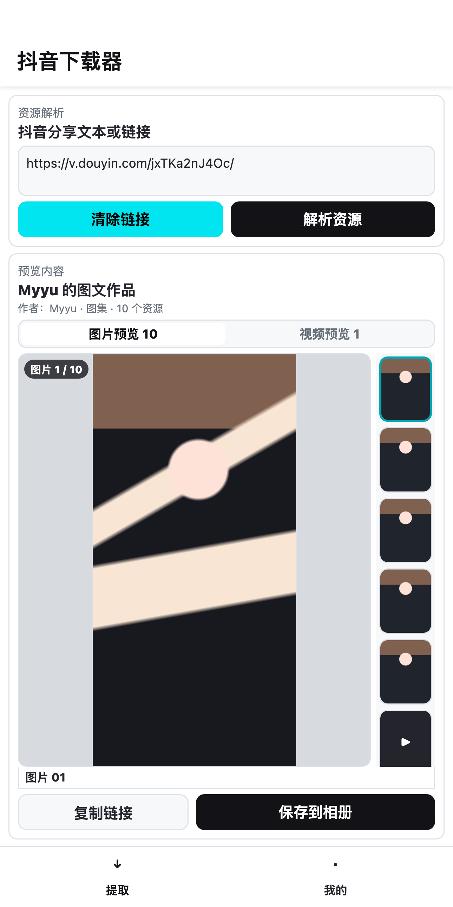
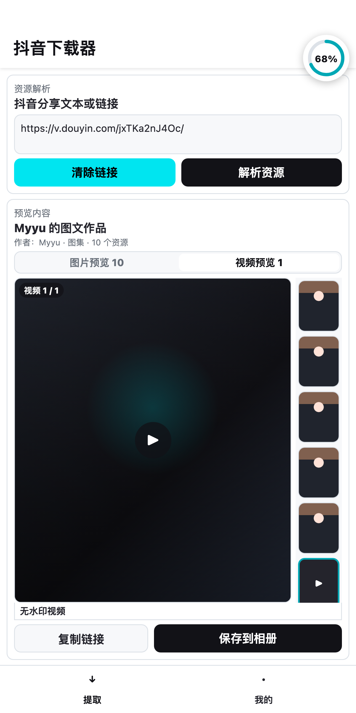
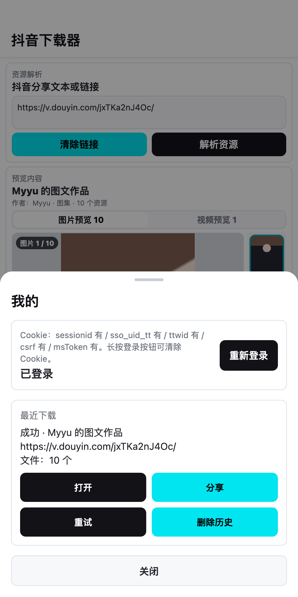

<p align="center">
  
</p>

<h1 align="center">抖音下载器</h1>

<p align="center">
  把抖音分享文本变成可确认、可预览、可保存、可回看的 Android 本地流程。
</p>

<p align="center">
  <a href="README.en.md">English</a> · <a href="https://github.com/addedf/video-downloader/releases/tag/v2.3.3">下载 v2.3.3</a>
</p>

抖音下载器是一个面向 Android 的开源工具，用于解析抖音分享文本、短链和作品链接，并将视频或图集保存到系统媒体库。应用使用原生 Android 界面承载操作，借助 Chaquopy 集成 Python 解析与下载逻辑。

## v2 设计：让下载成为一条连续的工具流程

这次重做不把重点放在“点一次下载”，而是把用户从拿到分享链接到找到已保存文件的过程连起来：

- **先确认，再解析。** 检测到剪贴板中的可解析链接后，应用会给出明确的确认入口；用户也可以手动粘贴、清除或修改输入内容，不会在未确认时直接开始处理。
- **先看内容，再保存。** 解析结果以资源预览为核心。图集和视频有清晰的切换入口，缩略图用于定位具体内容，确认无误后再保存到相册。
- **状态始终可见。** 保存开始后，进度浮层展示当前进度；用户不必在页面之间猜测任务是否还在运行。
- **结果可以回看和处理。** “我的”页面保留最近下载，支持打开、分享、失败重试和删除历史，让完成一次下载不是流程的终点。
- **界面保持紧凑直接。** 深色文字、白色内容区和青色操作强调色把层级收敛到链接、资源和动作本身，避免把工具界面做成营销页面。

## 使用路径

1. 在抖音复制分享文本或作品链接。
2. 回到应用，在剪贴板提示中选择“解析”，或手动粘贴后点击“解析资源”。
3. 在预览区切换图片/视频、浏览缩略图并确认内容。
4. 点击“保存到相册”，通过进度状态查看任务进展。
5. 在“我的 - 最近下载”中打开、分享、重试或清理记录。

## 界面预览

以下截图来自仓库中的 [v2 UI 对齐原型](docs/prototypes/app-ui-prototype.html)，用于呈现当前的交互状态和视觉方向。

| 检测到分享链接 | 解析后的资源预览 |
| --- | --- |
|  |  |

| 保存进度 | 登录状态与最近下载 |
| --- | --- |
|  |  |

## 功能范围

- 解析抖音分享文本、短链和作品链接
- 预览并保存视频、图集、封面等可用媒体资源
- 支持从 Android 系统分享菜单接收文本链接
- 通过内置 WebView 登录抖音，并在本地加密保存 Cookie
- 展示下载进度、速度和结果摘要
- 保存结果写入系统相册/媒体库，并提供最近下载的打开、分享与重试入口
- 启动时检查应用更新

具体可用内容受作品公开状态、平台规则和登录状态影响。

## Cookies 与隐私

部分内容可能需要登录状态。应用提供内置 WebView 登录页，登录后 Cookie 仅加密保存在设备本地，用于对应的抖音请求，不会上传到第三方服务。

请不要在 Issue、截图或日志中公开 `sessionid` 等 Cookie 内容。

## 开发环境

- Android Studio
- Android 9.0+（minSdk 28）
- JDK 11
- Kotlin、AndroidX、Material Components、Kotlin Coroutines
- Chaquopy + Python 3.12
- Moshi

## 项目结构

```text
app/src/main/java/com/zemin/downloader
+-- common/          # Android 与 Python 侧的公共接口、存储和工具能力
+-- impl/dy/         # 抖音平台桥接、登录与下载实现
+-- ui/              # 主界面、登录页和 UI 工具
+-- update/          # 应用更新检查

app/src/main/python
+-- dy/              # 抖音解析、下载与文件处理逻辑
+-- common/          # Python 与 Android 的交互工具
```

## 本地运行

1. 使用 Android Studio 打开项目。
2. 配置 Android SDK、JDK 11，以及 Chaquopy 所需的 Python 构建环境。
3. 安装到 Android 设备后，粘贴分享文本或通过系统分享菜单将链接发送到应用。

成功保存的媒体会注册到系统媒体库，通常可在以下目录查看：

- 视频：`Movies/<平台名>`
- 图片：`Pictures/<平台名>`

## 注意事项

- 本项目仅用于学习、研究和个人数据备份。
- 请遵守目标平台的用户协议、版权规则及当地法律法规。
- 请勿用于批量抓取、商业分发、侵权传播或其他不当用途。
- 第三方平台接口、风控策略和页面结构可能变化，相关功能需要持续维护。

## 项目参考

- [JoeanAmier/XHS-Downloader](https://github.com/JoeanAmier/XHS-Downloader)
- [jiji262/douyin-downloader](https://github.com/jiji262/douyin-downloader)

## 仓库说明

国内 Gitee 镜像仓库：[VideoDownloader](https://gitee.com/maomao999/video-downloader)
