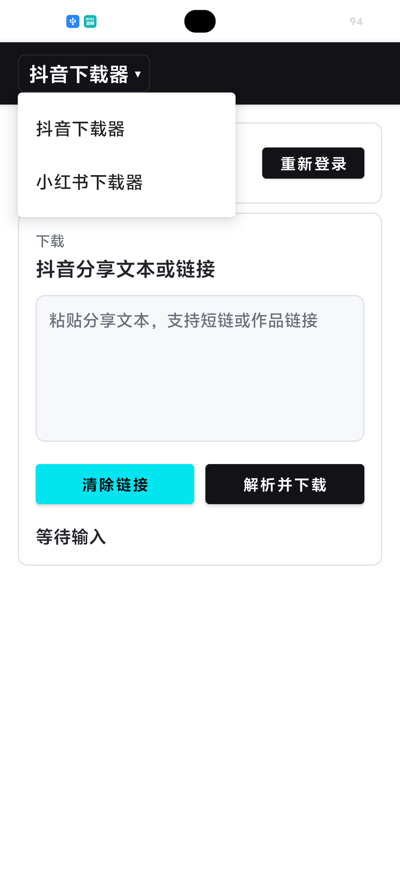
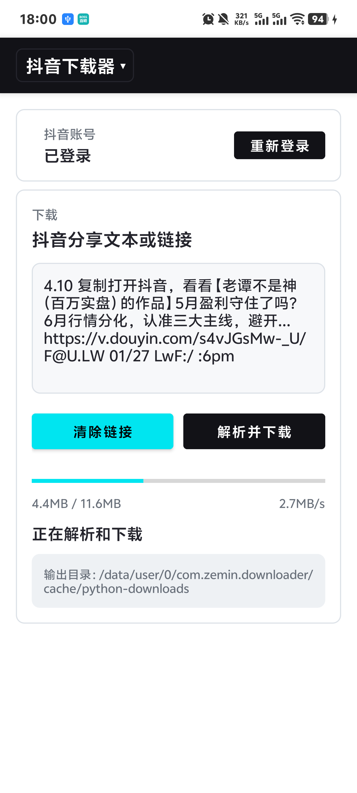
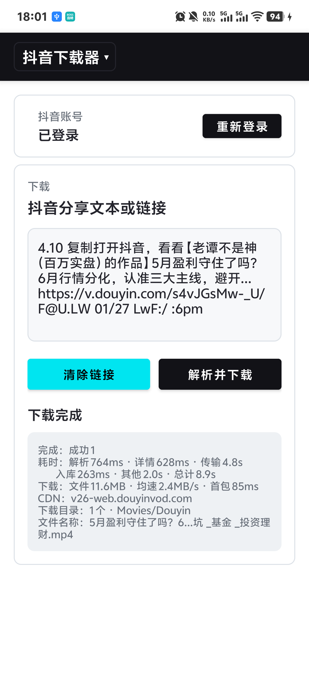

# 短视频下载器

这是一个面向 Android 端的短视频内容下载工具。

项目通过 Android 原生界面承载下载流程，并使用 Chaquopy 集成 Python 下载逻辑。目前内置抖音和小红书两个平台模块，支持从分享文本、短链或作品链接中解析内容，并将下载结果保存到系统媒体目录中。

## 界面预览

| 平台选择 | 下载中 | 下载完成 |
| --- | --- | --- |
|  |  |  |

## 功能特性

- 支持抖音、小红书平台切换
- 支持粘贴分享文本、短链或作品链接后解析下载
- 支持从系统分享菜单直接接收文本链接
- 支持需要登录的平台通过内置 WebView 保存登录 Cookie
- 支持下载进度、下载速度和结果摘要展示
- 支持视频、图片等媒体文件写入系统相册或媒体库
- 支持启动时检查应用更新
- 下载核心按平台拆分，便于继续扩展新的站点能力

## 技术栈

- Android 原生应用
- Kotlin
- XML 布局 + ViewBinding
- AndroidX AppCompat / Material Components
- Kotlin Coroutines
- Chaquopy
- Python 3.12
- Moshi

## 平台模块

项目通过统一的桥接接口管理不同平台能力：

- `Douyin`：抖音下载模块
- `Xhs`：小红书下载模块

Android 侧负责 UI、登录、存储、媒体注册和平台切换；Python 侧负责链接解析、接口请求、下载任务和结果回传。

## 项目结构

```text
app/src/main/java/com/zemin/downloader
+-- common/          # 公共接口、基础类、存储和工具能力
+-- impl/            # 平台能力实现
|   +-- dy/          # 抖音 Android 桥接模块
|   +-- xhs/         # 小红书 Android 桥接模块
+-- ui/              # 主界面、登录页和 UI 工具
+-- update/          # 应用更新检查

app/src/main/python
+-- dy/              # 抖音 Python 下载核心
+-- xhs/             # 小红书 Python 下载核心
+-- common/          # Python 与 Android 交互的公共工具
```

## 使用方式

1. 在 Android Studio 中打开项目。
2. 根据本地环境配置 Android SDK、Gradle JDK 和 Chaquopy 所需的 Python 环境。
3. 安装应用到 Android 设备。
4. 打开应用后选择平台，粘贴分享文本或链接，点击解析并下载。
5. 也可以在抖音、小红书等应用中通过系统分享菜单将链接发送到本应用。

下载完成后，媒体文件会写入系统媒体库：

- 视频：`Movies/<平台名>`
- 图片：`Pictures/<平台名>`

## 登录说明

部分平台能力可能依赖登录状态。应用内提供 WebView 登录页，登录完成后会保存 Cookie，并在后续下载请求中复用登录信息。

## 开发说明

新增平台时，可以参考现有抖音和小红书模块：

1. 在 Android 侧实现对应的登录、存储、下载和桥接模块。
2. 在 Python 侧提供统一入口方法，例如 `warm_up`、`refresh_cookies`、`download`。
3. 在平台配置中注册新的下载类型。
4. 保持 Android UI、桥接接口和 Python 返回结果格式一致。

## 注意事项

- 本项目仅用于学习、研究和个人数据备份场景。
- 请遵守目标平台的用户协议、版权规则和当地法律法规。
- 请勿将本项目用于批量抓取、商业分发、侵权传播或其他不当用途。
- 第三方平台接口、风控策略和页面结构可能随时变化，相关功能可能需要持续维护。

## 项目参考

- [JoeanAmier/XHS-Downloader](https://github.com/JoeanAmier/XHS-Downloader)
- [jiji262/douyin-downloader](https://github.com/jiji262/douyin-downloader)

## 仓库说明

国内gitee镜像仓库：[maozemin666/video-downloader](https://github.com/maozemin666/video-downloader) 
